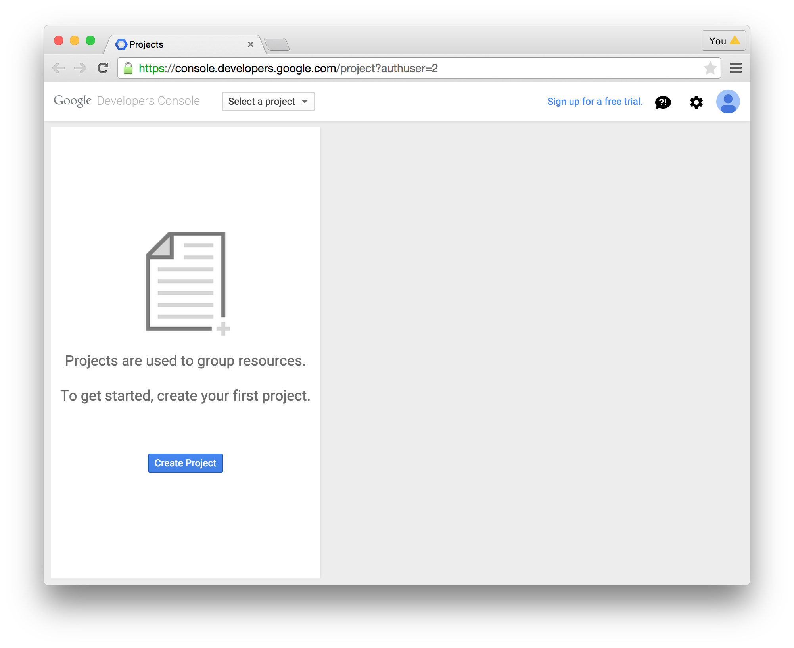
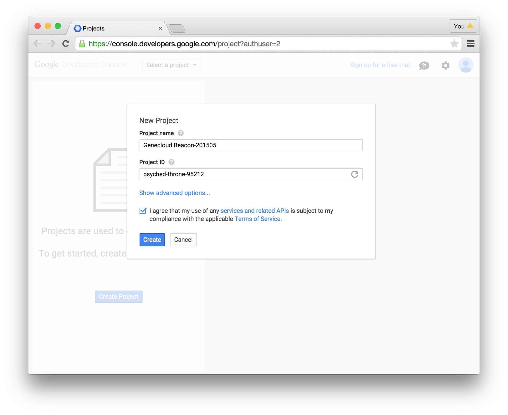
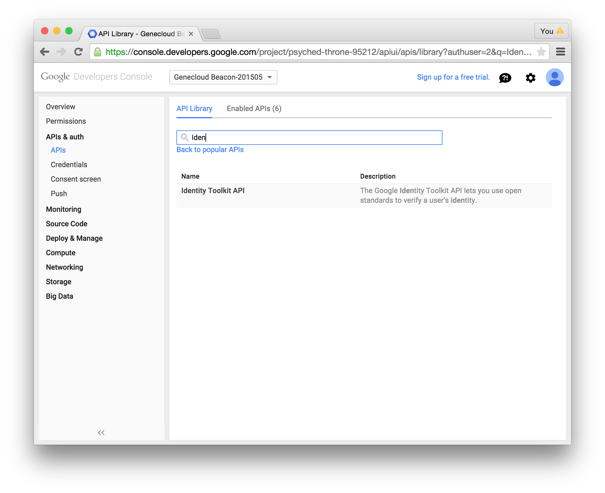
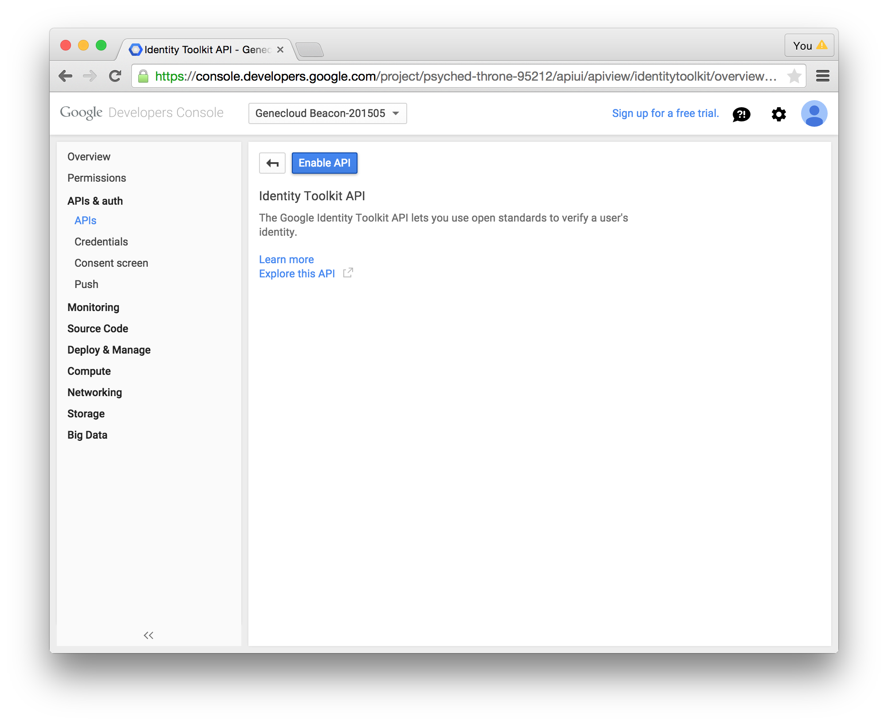
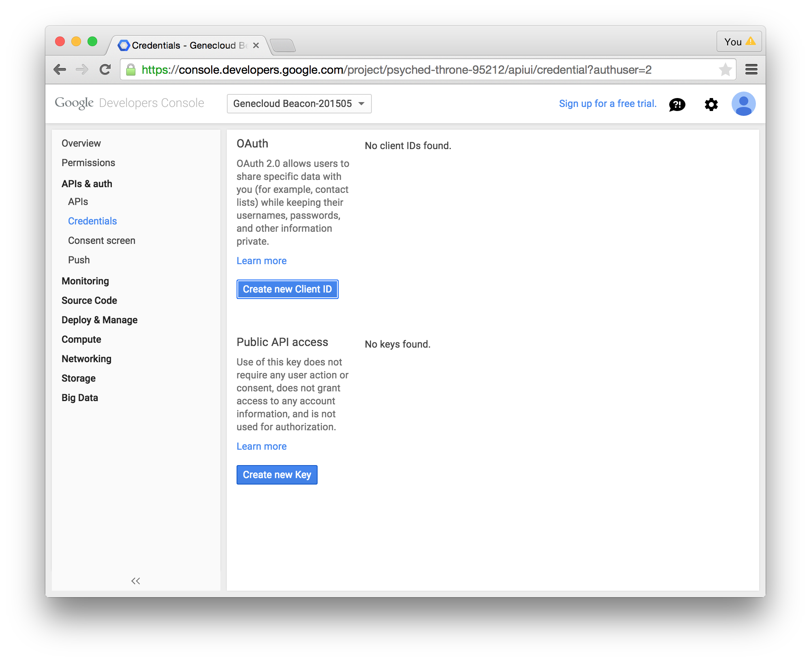
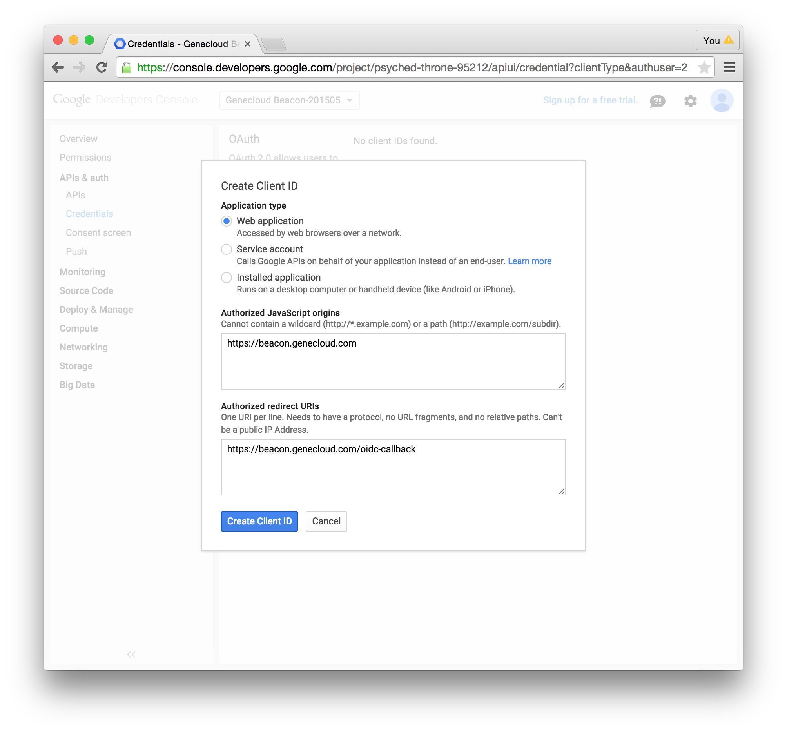
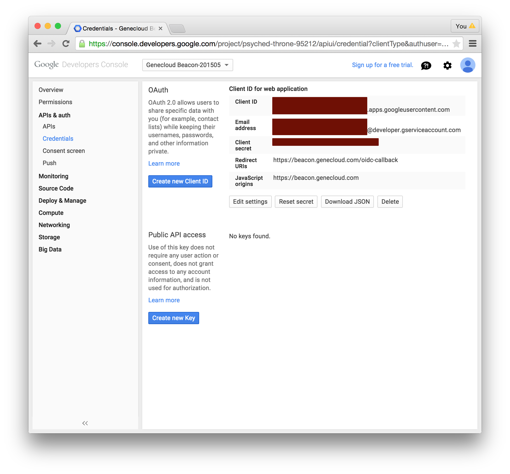

# Google Identity HOWTO (quick)

The full documentation for using Google's OpenID Connect service is [here](https://developers.google.com/identity/protocols/OpenIDConnect).  Most of that documentation is a reiteration of how OIDC/OAuth2 flows work, and how to implement them for maximum compatibility with Google.

This set of screenshots simply walks through the first few steps on that page, outlining how to register a client (aka "OpenID Connect Relying Party", aka "your beacon") with Google's Identity Service.  I'll refer to your beacon as your "application", these instructions are being created for the Beacon Working Group initially but they may be applicable to other GA4GH projects.

The first step is to log into Google's developer console at [https://console.developers.google.com/](https://console.developers.google.com/)...

... and create a project to represent your application:

In order to use the Google Identity API with your application you'll need to enable it in your project.  Google has a *LOT* of APIs, so you'll need to search.

Click on "Identity Toolkit API" to see the API page, hit the "Enable" button, and wait a few seconds for things to get set up behind the scenes.

Before you can jump right in to creating a Client ID, Google will require you to configure the consent screen for your application.  This is where the user will be prompted whether or not they want to share their identity information with you.  Click on the "Consent screen" link on the left to configure this.  You can add your name, a logo, some informational text, and some links.

Now that you've saved your consent screen details, you can configure a new Client ID for your application.  Click on the "Credendials" link on the left...

... and hit the button for "Create new Client ID".  You'll want to configure a "Web application" credential.  The most important thing in this dialog is the box for "Authorized redirect URIs".  OAuth2/OpenID Connect depend on the Authorization Server (that's Google) and the Client (that's you) being in agreement about this.  If you're using this [simplebeacon](https://github.com/Genecloud/simplebeacon), the only OAuth2/OIDC redirect URI is `/oidc-callback`.  You'll need to provide the scheme and hostname. _(you are using HTTPS... **right**?)_

Now that your client is created you'll see what you came here for: your Client ID and Client secret.  You can download the Client ID and secret along with a lot of other configuration bits in handy JSON format by clicking the "Download JSON" button. 

**Keep this information safe.  Keep it `chmod 700`, definitely don't email it around, don't leave it on a thumbdrive.**

If you think this credential has been compromised, just create another and reconfigure your application with the new ID and secret.

Now that you have client credentials in JSON, you can put it in your `oidc_secrets` directory and put an entry for it in your `op_config.json` with the type "google" (see the example).
